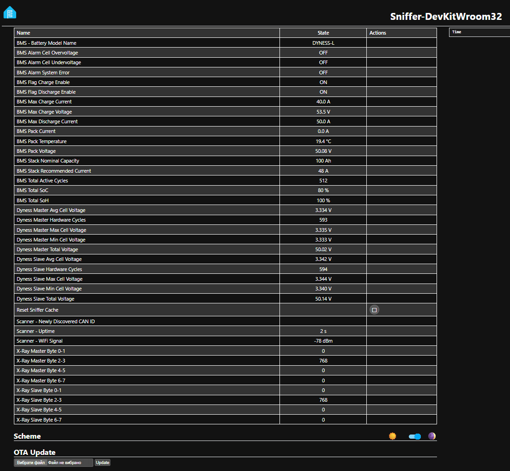

# ESPHome Dyness-L BMS CAN-Bus Sniffer & Inverter Integration

This repository contains a complete, production-ready ESPHome configuration for the ESP32 and SN65HVD230 transceiver, engineered to sniff and decode both the **11-bit standard Inverter Pylon Protocol** and the **29-bit extended engineering cascade frames** specific to **Dyness-L** battery storage systems (configured in a Master/Slave cascade topology).

Through live hardware reverse-engineering, this implementation decodes deep internal metrics per battery block (voltages, averages, true hardware cycles, and extreme cell deltas) without polling or console spam.

Inspired by and extending the architectural core of the [grericht/dyness-bms-esphome-canbus](https://github.com/grericht/dyness-bms-esphome-canbus) project.

---

## 🔬 Web Interface Preview

Here is an example of decoded real-time Master/Slave cascade telemetry displayed on the ESPHome native web server dashboard:



---

## 📂 Project Structure

```text
├── assets/
│   └── images/
│       └── web_sample.png                 # Web UI sample screenshot
├── docs/
│   ├── can_frames_dyness_l.md             # 29-bit Extended Big-Endian Cascade Map
│   ├── can_frames_pylon_l.md              # 11-bit Standard Little-Endian Inverter Map
│   └── pinout.md                          # RJ45 to Transceiver hardware schematics
├── README.md                              # Main documentation hub (This file)
└── sniffer_can_pylon_dyness.yml           # Monolithic production ESPHome YAML config
```

---

## 📟 Hardware Wiring Summary

To establish physical layer communication, connect your ESP32 board to the SN65HVD230 transceiver and route it directly to the primary RJ45 socket of the Master battery. Complete wiring diagrams, pin assignments (Pin 4 for CAN_H, Pin 5 for CAN_L), and differential bus termination rules are documented in the [Hardware Pinout Blueprint](docs/pinout.md).

---

## 🗺️ Extended Protocol Deep-Dive

We successfully mapped the complete binary matrix of the internal cascade network. Detailed breakdowns of scaling factors, multiplexer behavioral rules, and memory mapping addresses are fully documented inside the following registries:

- **Internal Engineering Cascade (29-bit Extended Big-Endian):** Explains hardware level telemetry including cell protection thresholds and internal clock cycles inside the [Cascade Telemetry Matrix](docs/can_frames.md).
- **Inverter Broadcasting Map (11-bit Standard Little-Endian):** Breaks down the emulated Pylontech structures used for active inverter throttling inside the [Inverter Protocol Matrix](docs/can_frames_pylon_l.md).

---

## 🛠️ Complete Production Configuration

The fully integrated, non-blocking automation code is contained in the repository core file. You can deploy it directly via OTA or command-line using the production script:

👉 **[Download sniffer_can_pylon_dyness.yml](sniffer_can_pylon_dyness.yml)**

This unified software contains the dynamic wideband capture logic, targeted filtering macros, active balancing telemetry tracking handlers, and the custom diagnostic runtime trap.

---

## 🕵️‍♂️ Dynamic Sniffer Trap Routine

The smart wideband capture engine runs at the base layer of the stack. It utilizes an hardware-level filter mask to process everything, drops known static traffic instantly via short-circuit return logic, and saves any unexpected frame format straight to a static array container to block log congestion:

```cpp
// Dynamic Sniffer Block - Fires only for unique unmapped frames
if (id(local_discovered_ids).find(can_id) == id(local_discovered_ids).end()) {
  if (id(local_discovered_ids).size() < 64) {
    id(local_discovered_ids).insert(can_id);
    
    char id_buffer[32];
    sprintf(id_buffer, "0x%X", (unsigned int)can_id);
    
    std::string raw_bytes_str = "";
    char byte_buffer[8];
    for (size_t i = 0; i < x.size(); i++) {
      sprintf(byte_buffer, "%02X ", x.at(i));
      raw_bytes_str += byte_buffer;
    }
    
    std::string full_web_output = std::string(id_buffer) + " [" + raw_bytes_str + "]";
    id(ts_new_id).publish_state(full_web_output);
    
    ESP_LOGI("sniffer", "NEW UNKNOWN ID DETECTED: %s", full_web_output.c_str());
  }
}
```

---

## 📜 License & Acknowledgments

- Architectural foundation based on the [grericht/dyness-bms-esphome-canbus](https://github.com/grericht/dyness-bms-esphome-canbus) repository.
- Extended, multi-node reverse engineering, testing, and implementation completed by [@Volodymyr16k](https://github.com/Volodymyr16k).
- Provided under the MIT License. Feel free to use, modify, and distribute for personal or commercial battery storage integration.
